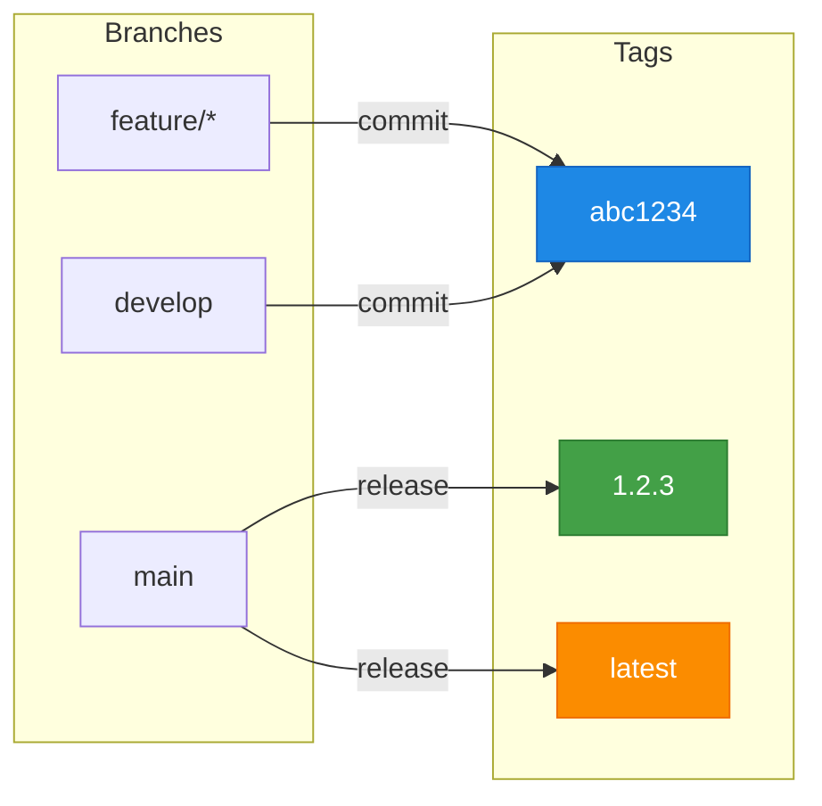

# Container GitOps Pipeline

Reusable GitHub Actions workflows for container-based GitOps pipelines. Build Docker images and Helm charts with semantic versioning, multi-arch support, and automated GitOps deployment.

## Features

- **Semantic Versioning** - Automated releases with [semantic-release](https://github.com/semantic-release/semantic-release)
- **Multi-Architecture** - Native amd64 and arm64 builds via GitHub runners (no QEMU)
- **GitOps Ready** - Works with [gitops-image-replacer](https://github.com/slauger/gitops-image-replacer) for ArgoCD deployments
- **OCI Registry** - Push Docker images and Helm charts to any OCI-compliant registry
- **Zero Config** - Sensible defaults, no `.releaserc.json` required
- **Pinned Dependencies** - All tools versioned and managed via Renovate

### Versioning Strategy



| Branch | Image Tags | Helm Version |
|--------|------------|--------------|
| `feature/*` | `:abc1234` | `abc1234` |
| `develop` | `:abc1234` | `abc1234` |
| `main` | `:1.2.3`, `:1.2`, `:abc1234`, `:latest` | `1.2.3` |

## Quick Start

**1. Create `.github/workflows/build.yaml` in your repo:**

```yaml
name: Build

on:
  push:
    branches: [main, develop]
  pull_request:

jobs:
  build:
    uses: slauger/container-gitops-pipeline/.github/workflows/docker-build.yaml@main
    with:
      image_name: my-app
```

**2. Push and watch the magic happen.**

No secrets needed for public repos with GHCR. The workflow uses `github.token` automatically.

## Workflows

### Docker Build

Builds and pushes Docker images with semantic versioning and multi-arch support.

```yaml
jobs:
  build:
    uses: slauger/container-gitops-pipeline/.github/workflows/docker-build.yaml@main
    with:
      image_name: my-app
      platforms: 'linux/amd64,linux/arm64'  # optional, default: linux/amd64
```

**Inputs:**

| Input | Description | Default |
|-------|-------------|---------|
| `image_name` | Image name (without registry) | *required* |
| `dockerfile` | Path to Dockerfile | `Dockerfile` |
| `context` | Build context | `.` |
| `platforms` | Target platforms (comma-separated) | `linux/amd64` |
| `registry` | Container registry | `ghcr.io` |

**Outputs:**

| Output | Description |
|--------|-------------|
| `version` | Released version (semver or short sha) |
| `image` | Full image reference |

**Generated Tags:**

For multi-arch builds, both manifest tags and arch-specific tags are created:

```
ghcr.io/owner/my-app:1.2.3              # manifest (auto-selects arch)
ghcr.io/owner/my-app:1.2.3-linux-amd64  # explicit amd64
ghcr.io/owner/my-app:1.2.3-linux-arm64  # explicit arm64
ghcr.io/owner/my-app:latest-linux-amd64 # latest for specific arch (GitOps)
```

### Helm OCI

Packages and pushes Helm charts to an OCI registry.

```yaml
jobs:
  release:
    uses: slauger/container-gitops-pipeline/.github/workflows/helm-oci.yaml@main
    with:
      chart_path: './chart'
```

**Inputs:**

| Input | Description | Default |
|-------|-------------|---------|
| `chart_path` | Path to Helm chart directory | `.` |
| `registry` | OCI registry | `ghcr.io` |

**Outputs:**

| Output | Description |
|--------|-------------|
| `version` | Released chart version |
| `chart` | Full chart OCI reference |

## Multi-Architecture Builds

Each platform builds on its native runner for maximum performance:

| Platform | GitHub Runner |
|----------|---------------|
| `linux/amd64` | `ubuntu-latest` |
| `linux/arm64` | `ubuntu-24.04-arm64` |

ARM runners are available for:
- Public repositories (free)
- GitHub Team/Enterprise plans

## Repository Structure

Recommended structure for projects using these workflows:

```
my-app-image/                    my-app-chart/
├── Dockerfile                   ├── Chart.yaml
├── src/                         ├── values.yaml
└── .github/workflows/           ├── templates/
    └── build.yaml               └── .github/workflows/
                                     └── release.yaml
```

## Semantic Release

The workflows include a default semantic-release configuration. No `.releaserc.json` needed.

**Default config:**
- Branches: `main`, `master`
- Conventional commits preset
- GitHub releases

**Custom config:** Add your own `.releaserc.json` to override.

## Builder Image

A builder image with pre-installed tools is available:

```
ghcr.io/slauger/container-gitops-pipeline/builder:latest
```

**Included tools:**
- Docker CLI
- Helm
- hadolint
- yq / jq
- semantic-release (with plugins)
- Node.js / npm

All versions are pinned and updated via Renovate.

## License

MIT
