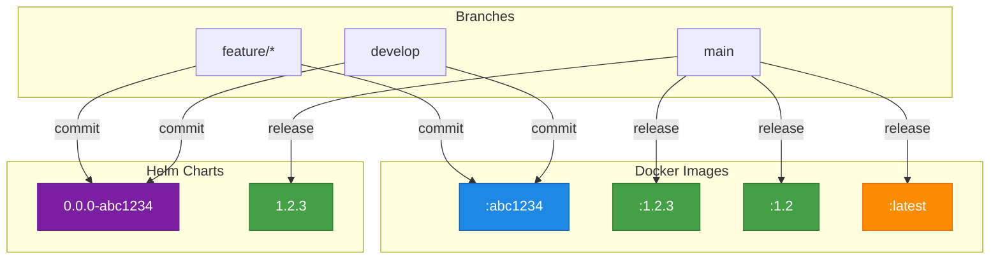

# Container GitOps Pipeline

Reusable GitHub Actions workflows for container-based GitOps pipelines. Build Docker images and Helm charts with semantic versioning, multi-arch support, and automated GitOps deployment.

## Features

- 🏷️ **Semantic Versioning** - Automated releases with [semantic-release](https://github.com/semantic-release/semantic-release)
- 🖥️ **Multi-Architecture** - Native amd64 and arm64 builds via GitHub runners (no QEMU)
- 🔄 **GitOps Ready** - Works with [gitops-image-replacer](https://github.com/slauger/gitops-image-replacer) for ArgoCD deployments
- 📦 **OCI Registry** - Push Docker images and Helm charts to any OCI-compliant registry
- ⚡ **Zero Config** - Sensible defaults, no `.releaserc.json` required
- 📌 **Pinned Dependencies** - All tools versioned and managed via Renovate

### Versioning Strategy



## Quick Start: Docker Images

Add `.github/workflows/build.yaml` to your repository:

```yaml
name: Build
on:
  push:
    branches: [main, develop]

jobs:
  build:
    uses: slauger/container-gitops-pipeline/.github/workflows/docker-build.yaml@v1
    with:
      image_name: my-app
```

## Quick Start: Helm Charts

Add `.github/workflows/release.yaml` to your repository:

```yaml
name: Release
on:
  push:
    branches: [main, develop]

jobs:
  release:
    uses: slauger/container-gitops-pipeline/.github/workflows/helm-oci.yaml@v1
    with:
      chart_path: '.'
```

## Documentation

| | |
|---|---|
| [Docker Build](https://slauger.github.io/container-gitops-pipeline/docker-build/) | Build and push container images |
| [Helm OCI](https://slauger.github.io/container-gitops-pipeline/helm-oci/) | Package and push Helm charts |
| [Multi-Architecture](https://slauger.github.io/container-gitops-pipeline/multi-arch/) | Native amd64 and arm64 builds |
| [Configuration](https://slauger.github.io/container-gitops-pipeline/configuration/) | All workflow inputs and outputs |

## License

MIT
