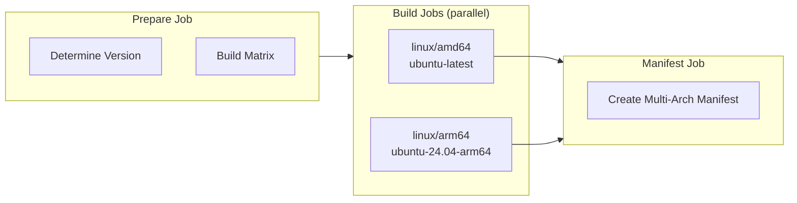

# Multi-Architecture Builds

The Docker Build workflow supports building for multiple architectures using native GitHub runners - no QEMU emulation required.

## Enabling Multi-Arch

```yaml
jobs:
  build:
    uses: slauger/container-gitops-pipeline/.github/workflows/docker-build.yaml@v1
    with:
      image_name: my-app
      platforms: 'linux/amd64,linux/arm64'
```

## How It Works

Each platform builds in a separate job on its native runner:



## Runner Mapping

| Platform | GitHub Runner |
|----------|---------------|
| `linux/amd64` | `ubuntu-latest` |
| `linux/arm64` | `ubuntu-24.04-arm64` |

## Requirements

GitHub ARM runners are available for:

- ✅ Public repositories (free)
- ✅ GitHub Team plans
- ✅ GitHub Enterprise plans
- ❌ Private repos on Free/Pro plans

!!! warning
    If you enable ARM builds on a private repository without the required plan, the workflow will fail.

## Generated Tags

Multi-arch builds produce both manifest tags and arch-specific tags:

```
# Manifests (Docker auto-selects correct arch)
ghcr.io/owner/my-app:1.2.3
ghcr.io/owner/my-app:latest

# Arch-specific (for explicit selection)
ghcr.io/owner/my-app:1.2.3-linux-amd64
ghcr.io/owner/my-app:1.2.3-linux-arm64
ghcr.io/owner/my-app:latest-linux-amd64
ghcr.io/owner/my-app:latest-linux-arm64
```

## GitOps with Arch-Specific Tags

For GitOps deployments where you need to specify the exact architecture (e.g., mixed clusters):

```yaml
# Deployment for amd64 cluster
image:
  repository: ghcr.io/owner/my-app
  tag: latest-linux-amd64

# Deployment for arm64 cluster (Raspberry Pi, Graviton, etc.)
image:
  repository: ghcr.io/owner/my-app
  tag: latest-linux-arm64
```

## Performance

Native runners are significantly faster than QEMU emulation:

| Approach | ARM64 Build Time |
|----------|------------------|
| QEMU emulation | 10-30 minutes |
| Native runner | 2-5 minutes |

## Adding More Architectures

You can add additional platforms as needed:

```yaml
platforms: 'linux/amd64,linux/arm64,linux/arm/v7'
```

Unknown platforms fall back to `ubuntu-latest` with QEMU emulation.
